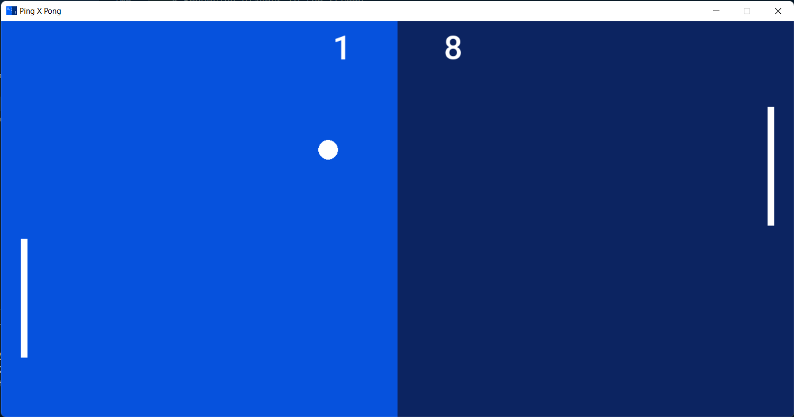

# Ping X Pong

A simple game using ```python``` and ```pygame```

I only made this little game to challenge myself (and maybe try some advanced game developpement later if I like it)

If you want to play the game just clone the project folder and and install pygame on your system (assuming you already have a version of python installed on your machine)

>```
> pip install pygame
>```

## Progress
- The game now supports PvP mode
- No settings menu
- No leveling system or difficulty settings yet
- No sound effects yet
- No home screen yet
- No PvComputer mode yet
## Game Controls
Both players have only two actions to do (Up/Down
)

The player on the left using &nbsp;<kbd style="padding: .5rem 1rem;">W</kbd>&nbsp; and &nbsp;<kbd style="padding: .5rem 1rem;">S</kbd>&nbsp;

The player on the right using &nbsp;<kbd style="padding: .5rem 1rem;">&uparrow;</kbd>&nbsp; and &nbsp;<kbd style="padding: .5rem 1rem;">&downarrow;</kbd>&nbsp;
## Preview


### Programming langauges used


### Contributors
* [DAKIR ALLAH Abderrahman](https:/github.com/black-purple)
  
  